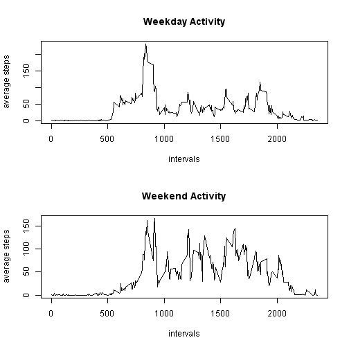

# Reproducible Research: Peer Assessment 1


## Loading and preprocessing the data


```r
data <- read.csv("activity.csv")
days <- split(data, data[["date"]])
intervals <- split(data, as.factor(data[["interval"]]))
steps <- numeric()
intervalAverage <- numeric()
for (day in names(days)) {
    steps <- append(steps, sum(days[[day]]["steps"]))
}
for (interval in names(intervals)) {
    intervalAverage <- append(intervalAverage, mean(intervals[[interval]][["steps"]], 
        na.rm = TRUE))
}
```


## What is mean total number of steps taken per day?


```r
hist(steps)
```

 

```r
mean(steps, na.rm = TRUE)
```

```
## [1] 10766
```

```r
median(steps, na.rm = TRUE)
```

```
## [1] 10765
```


## What is the average daily activity pattern?


```r
plot(names(intervals), intervalAverage, type = "l", xlab = "intervals", ylab = "average steps")
```

 


The interval that has the highest average is:


```r
names(intervals[match(max(intervalAverage), intervalAverage)])
```

```
## [1] "835"
```


## Imputing missing values

Number of rows that have NA values:


```r
sum(is.na(data[["steps"]]))
```

```
## [1] 2304
```


I will impute by replacing NAs with the average steps for that interval.


```r
for (index in 1:nrow(data)) {
    if (is.na(data[index, "steps"])) {
        intervalName <- as.character(data[index, "interval"])
        data[index, "steps"] <- mean(intervals[[intervalName]][["steps"]], na.rm = TRUE)
    }
}
```


And here are the results again after imputation:


```r
days <- split(data, data[["date"]])
steps <- numeric()
for (day in names(days)) {
    steps <- append(steps, sum(days[[day]]["steps"]))
}
hist(steps)
```

 

```r
mean(steps)
```

```
## [1] 10766
```

```r
median(steps)
```

```
## [1] 10766
```


## Are there differences in activity patterns between weekdays and weekends?


```r
weekday <- factor()
for (index in 1:nrow(data)) {
    dayName <- weekdays(as.Date(as.character(data[index, "date"])))
    if (dayName == "Saturday" | dayName == "Sunday") {
        weekday <- append(weekday, "Weekend")
    } else {
        weekday <- append(weekday, "Weekday")
    }
}
data <- cbind(data, weekday)
dataByDay <- split(data, data[["weekday"]])
par(mfrow = c(2, 1))
intervals <- split(dataByDay[[1]], as.factor(dataByDay[[1]][["interval"]]))
intervalAverage <- numeric()
for (interval in names(intervals)) {
    intervalAverage <- append(intervalAverage, mean(intervals[[interval]][["steps"]], 
        na.rm = TRUE))
}
plot(names(intervals), intervalAverage, type = "l", xlab = "intervals", ylab = "average steps", 
    main = "Weekday Activity")
intervals <- split(dataByDay[[2]], as.factor(dataByDay[[2]][["interval"]]))
intervalAverage <- numeric()
for (interval in names(intervals)) {
    intervalAverage <- append(intervalAverage, mean(intervals[[interval]][["steps"]], 
        na.rm = TRUE))
}
plot(names(intervals), intervalAverage, type = "l", xlab = "intervals", ylab = "average steps", 
    main = "Weekend Activity")
```

 

